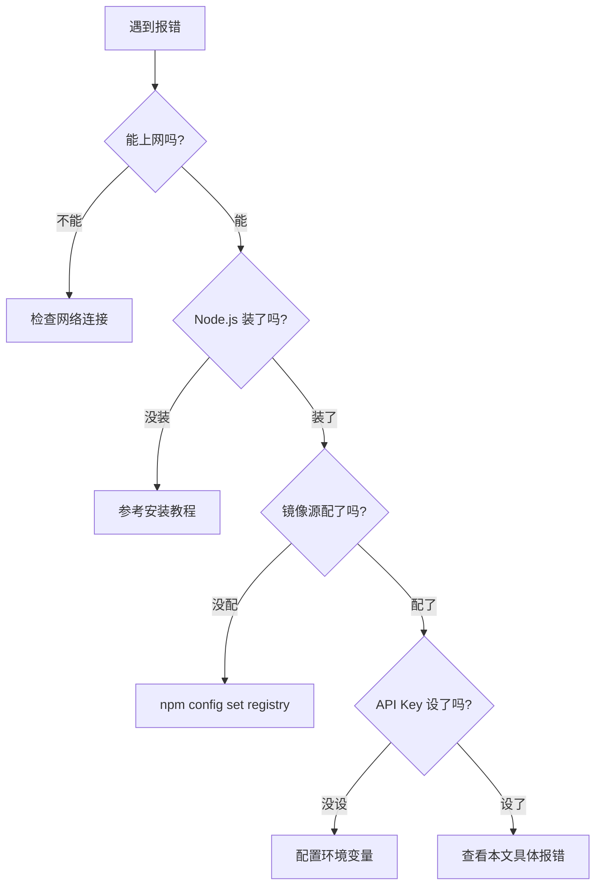

# 🐛 常见报错速查表

> 遇到红色报错别慌张，在这里搜索你的错误关键词，99% 的问题都有解。

---

## 网络类错误

### `ETIMEDOUT` / `ESOCKETTIMEDOUT`

```
npm ERR! code ETIMEDOUT
npm ERR! errno ETIMEDOUT
npm ERR! network request to https://registry.npmjs.org/... failed
```

| 项目 | 内容 |
|------|------|
| **原因** | npm 无法连接官方源，请求超时 |
| **解决** | 配置国内镜像源：`npm config set registry https://registry.npmmirror.com` |

---

### `ECONNREFUSED`

```
Error: connect ECONNREFUSED 127.0.0.1:7890
```

| 项目 | 内容 |
|------|------|
| **原因** | 系统配置了代理但代理软件未运行 |
| **解决** | ① 启动代理软件<br/>② 或取消代理设置：`unset HTTP_PROXY HTTPS_PROXY`（Mac/Linux） |

---

### `getaddrinfo EAI_AGAIN`

```
Error: getaddrinfo EAI_AGAIN registry.npmjs.org
```

| 项目 | 内容 |
|------|------|
| **原因** | DNS 解析失败，无法找到目标服务器 |
| **解决** | ① 检查网络连接<br/>② 更换 DNS：`8.8.8.8` 或 `114.114.114.114`<br/>③ 配置 npm 镜像源 |

---

### `certificate has expired` / `UNABLE_TO_VERIFY_LEAF_SIGNATURE`

```
npm ERR! code UNABLE_TO_VERIFY_LEAF_SIGNATURE
```

| 项目 | 内容 |
|------|------|
| **原因** | SSL 证书验证失败（常见于公司网络或有中间人代理的环境） |
| **解决** | `npm config set strict-ssl false`（注意：这会降低安全性，仅作为临时方案） |

---

### `403 Forbidden`

```
Error: 403 Forbidden
```

| 项目 | 内容 |
|------|------|
| **原因** | 请求被服务器拒绝，通常是 API Key 无效或过期 |
| **解决** | 检查 `ANTHROPIC_AUTH_TOKEN` 是否正确设置：`echo $ANTHROPIC_AUTH_TOKEN` |

---

## 安装类错误

### `EACCES` 权限错误（Mac/Linux）

```
npm ERR! code EACCES
npm ERR! syscall access
npm ERR! path /usr/local/lib/node_modules
```

| 项目 | 内容 |
|------|------|
| **原因** | 没有权限写入系统级 node_modules 目录 |
| **解决** | 方案一：使用 nvm 管理 Node.js（推荐）<br/>方案二：`npm config set prefix '~/.npm-global'` |

---

### `node: not found` / `'node' 不是内部或外部命令`

```
'node' is not recognized as an internal or external command
```

| 项目 | 内容 |
|------|------|
| **原因** | Node.js 未安装或未添加到 PATH |
| **解决** | ① 检查是否安装：`node --version`<br/>② 如未安装，参考[安装教程](/guide/)<br/>③ 如已安装，检查 PATH 是否包含 Node.js 路径 |

---

### `npm: command not found`

| 项目 | 内容 |
|------|------|
| **原因** | npm 未安装（通常随 Node.js 一起安装） |
| **解决** | 重新安装 Node.js，选择 LTS 版本 |

---

## 运行类错误

### `Claude Code 启动后闪退`（Windows）

| 项目 | 内容 |
|------|------|
| **原因** | 可能是杀毒软件拦截，或环境变量配置有问题 |
| **解决** | ① 将 Claude Code 添加到安全软件白名单<br/>② 在 PowerShell 中运行 `claude` 看报错信息<br/>③ 检查环境变量是否正确 |

---

### `ANTHROPIC_AUTH_TOKEN not found`

```
Error: ANTHROPIC_AUTH_TOKEN environment variable is not set
```

| 项目 | 内容 |
|------|------|
| **原因** | 未设置 API Key |
| **解决** | 参考[网络配置专题](/guide/network) 配置环境变量 |

---

### `unsupported protocol` / `Protocol "https:" not supported`

```
Error: Protocol "https:" not supported. Expected "http:"
```

| 项目 | 内容 |
|------|------|
| **原因** | 环境变量 `ANTHROPIC_BASE_URL` 格式错误 |
| **解决** | 检查 URL 是否正确，必须以 `https://` 开头，不要有多余引号或空格 |

---

## npm 类错误

### `ENOENT` - 文件不存在

```
npm ERR! enoent ENOENT: no such file or directory
```

| 项目 | 内容 |
|------|------|
| **原因** | 当前目录下缺少 package.json 文件 |
| **解决** | 全局安装使用 `-g` 参数：`npm install -g @anthropic-ai/claude-code` |

---

### 安装速度极慢 / 卡住不动

| 项目 | 内容 |
|------|------|
| **原因** | 没有配置国内镜像源 |
| **解决** | `npm config set registry https://registry.npmmirror.com` |

---

## Windows 特有问题

### 终端乱码

| 项目 | 内容 |
|------|------|
| **原因** | Windows 终端默认使用 GBK 编码 |
| **解决** | 在 PowerShell 中执行：`[Console]::OutputEncoding = [System.Text.Encoding]::UTF8`<br/>或使用 Windows Terminal 替代系统自带终端 |

---

### 执行策略 (ExecutionPolicy) 错误

```
无法加载文件，因为在此系统上禁止运行脚本
```

| 项目 | 内容 |
|------|------|
| **原因** | PowerShell 默认禁止运行脚本 |
| **解决** | 以管理员身份运行：`Set-ExecutionPolicy RemoteSigned` |

---

## 📊 快速诊断流程



---

## ❓ 找不到你的报错？

如果以上列表没有你的报错信息：

1. 复制完整的报错信息
2. [加微信](/services/) 发送给我们
3. 一般 5 分钟内帮你定位和解决

> 💡 **提示**：截图时请截完整的报错信息，越详细越容易定位问题。
