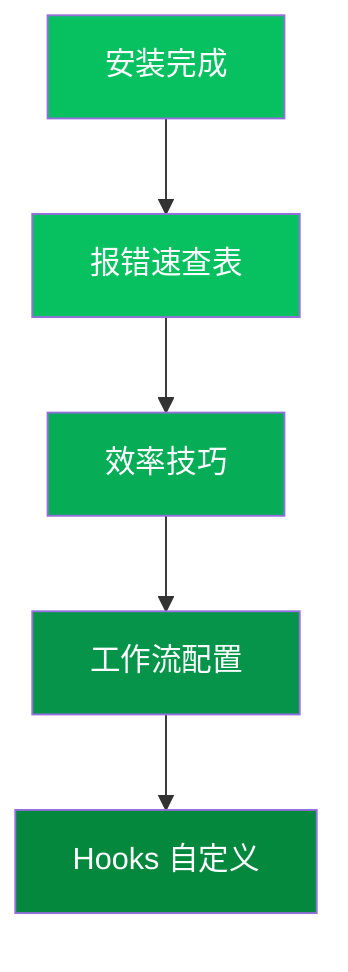

# 🔧 进阶使用总览

安装完成只是第一步。掌握以下进阶内容，让你的 Claude Code 效率拉满。

---

## 📚 内容导航

| 文档 | 内容 | 适合人群 |
|------|------|----------|
| [常见报错速查](/advanced/common-errors) | 20+ 常见报错及解决方案 | 所有人 |
| [实用工作流配置](/advanced/workflows) | 自动化工作流，让 Claude 按你的节奏工作 | 进阶用户 |
| [Hooks 与自定义配置](/advanced/hooks-custom) | 用 Hooks 定制 Claude Code 行为 | 高阶用户 |
| [效率提升技巧](/advanced/tips) | 日常使用的 20 个技巧 | 所有人 |

---

## 🗺️ 学习路径建议

---

## ❓ 进阶使用的常见疑问

### 我技术一般，能看懂这些吗？

进阶内容都配有**代码块**和**步骤说明**，复制粘贴即可使用。不懂原理完全不影响使用效果。

### 需要多久能上手？

- 报错速查表：**5 分钟**，碰到报错就查
- 效率技巧：**15 分钟**，看完就能在日常中用
- 工作流：**30 分钟**，配置好后一劳永逸
- Hooks：按需学习，不一定每个人都需要

---

## 🚀 快速跳转

- 🐛 [报错了？先来这里看看](/advanced/common-errors)
- ⚡ [想提效？看这 20 个技巧](/advanced/tips)
- 🤖 [想让 Claude 自动干活？配置工作流](/advanced/workflows)
- 🔩 [想定制 Claude 的行为？学 Hooks](/advanced/hooks-custom)
